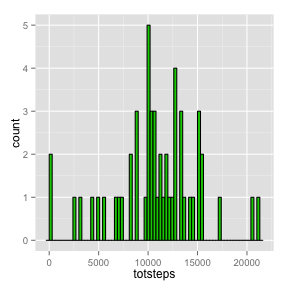
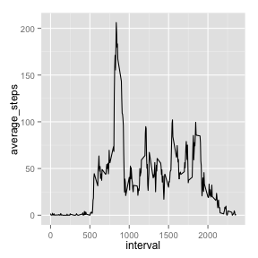
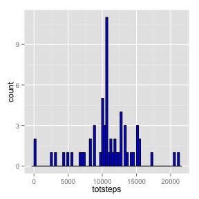
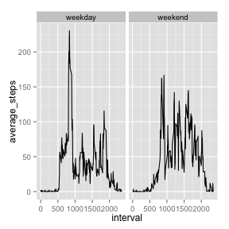

## Loading and preprocessing the data
This code chunk unzips and reads the activity data, storing it in variable act.

```r
unzip("activity.zip")
act<-read.csv("activity.csv")
```

## What is mean total number of steps taken per day?
This code chunk calculates the total number of steps taken per day.

```r
library(plyr)
Tsteps <- ddply(act,.(date),summarize,totsteps=sum(steps,rm.na=TRUE))
```

This code chunk plots a histogram of the total number of steps taken per day.

```r
library(ggplot2)
g <- ggplot(Tsteps,aes(totsteps))
g + geom_histogram(fill=3,color=1,binwidth=300)
```

 

This code chunk calculates the mean and median number of steps taken per day.

```r
smean = mean(Tsteps$totsteps, na.rm=TRUE)
smedian = median(Tsteps$totsteps, na.rm=TRUE)
```

The mean total number of steps taken per day is 1.0767189 &times; 10<sup>4</sup> and the median total number of steps taken per day is 10766. 

## What is the average daily activity pattern?
This code chunk calculates the average number of steps in each 5 min interval across all days

```r
steps5min <- ddply(act,.(interval),summarize,average_steps=mean(steps,na.rm=TRUE))
```

This code chunk plots the timeseries of the average number of steps taken in each 5 min interval

```r
g <- ggplot(steps5min, aes(x=interval,y=average_steps))
g + geom_line()
```

 

This code chunk calculates and prints the interval which has the maximum number of steps

```r
maxSteps = max(steps5min$average_steps)
maxStepsInt<-steps5min[steps5min$average_steps == maxSteps,"interval"]
```

The 5-min interval with the maximum number of steps is 835.

## Imputing missing values
This code chunk calculates the number of missing values in the dataset

```r
missing <- sum(is.na(act[,"steps"]))
```

There are 2304 missing values in the dataset.

This code chunk fills in missing values in a new dataset (newact) using average steps in each interval.

```r
newact<-act
for (i in 1:length(act$steps)){
    if (is.na(newact[i,"steps"]))
        newact[i,"steps"] <- steps5min[steps5min$interval==newact[i,"interval"],"average_steps"]
}
```

This code chunk plots the new histogram of the total number of steps taken a day.

```r
Tsteps2 <- ddply(newact,.(date),summarize,totsteps=sum(steps,rm.na=TRUE))
g <- ggplot(Tsteps2,aes(totsteps))
g + geom_histogram(fill=4,color=1,binwidth=300)
```

 

This code chunk calculates the new mean and median number of steps taken per day.

```r
smean2 = mean(Tsteps2$totsteps, na.rm=TRUE)
smedian2 = median(Tsteps2$totsteps, na.rm=TRUE)
```

The mean total number of steps taken per day is 1.0767189 &times; 10<sup>4</sup> and the median total number of steps taken per day is 1.0767189 &times; 10<sup>4</sup>.

## Are there differences in activity patterns between weekdays and weekends?
This code chunk creates a new factor variable with information about whether the day is a weekday or weekend.

```r
weekdays <- weekdays(as.Date(newact$date))
days<-c("Monday","Tuesday","Wednesday","Thursday","Friday","Saturday","Sunday")
for (i in 1:length(weekdays)){
    weekday[i]<-(sum(weekdays[i]==days[1:5]))
}
day<-factor(weekday,c(1,0),c("weekday","weekend"))
newact<-cbind(newact,day)
```

This code chunk calculates and plots the average steps taken in each 5-min interval for across all weekdays and weekends.

```r
steps5min2 <- ddply(newact,.(day, interval),summarize,average_steps=mean(steps))
g<-ggplot(steps5min2,aes(x=interval,y=average_steps))
g+geom_line()+facet_grid(.~day)
```

 
